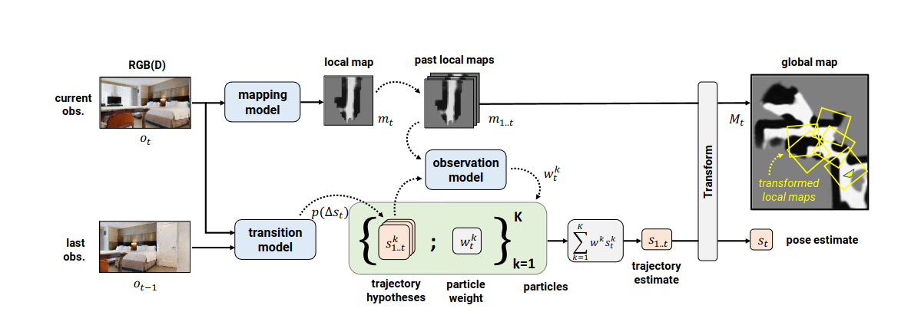

# Diff-Slam-Extension to NuScenes 
#deeprob project work

##Differentiable SLAM-net Architecture




# Installation [Under Progress]

## Cloning The Repo

To clone the entirety of the repository:
```
git clone git@github.com:RaghavM11/Diff-Slam.git
git submodule update --init --recursive
```

## Installation via `pipenv`

There's multiple ways to install this correctly, but Dylan likes `pipenv` and it seems to work okay for him.

Tested on:
- Ubuntu 22.04
- CMake version 3.17 (>= recommended)
-

Install requriments using : 

```

pip install -r /path/to/requirements.txt

```
## Installation via Anaconda

1. Setup Conda env. (should have miniconda installed)
````
conda create -n myenv python=3.9 
````
2. Activate conda 

```
conda activate myenv

```
3. Install dependecies in conda env following Via Installation Script 


## Contact
If you have any questions or suggestions about this repo, please feel free to contact (imraghav@umich.edu).

## Citation
If you find part of this work useful please cite applications and please consider giving this repo a star

For citing original work by authors refer the following BibTeX entry.

```BibTeX
@article{jiang2023vad,
  title={Differentiable SLAM-net: Learning Particle SLAM for Visual Navigation},
  author={Peter Karkus Shaojun Cai David Hsu},
  journal={CVPR},
  year={2021}
}
```

## License
All code in this repository is under the [MIT License].

## Acknowledgement
Diff Slam is based on the following work by Peter Karkus Shaojun Cai and David Hsu
https://sites.google.com/view/slamnet
